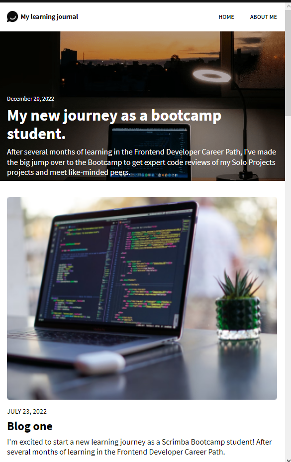
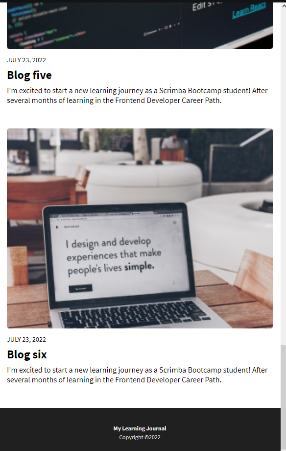
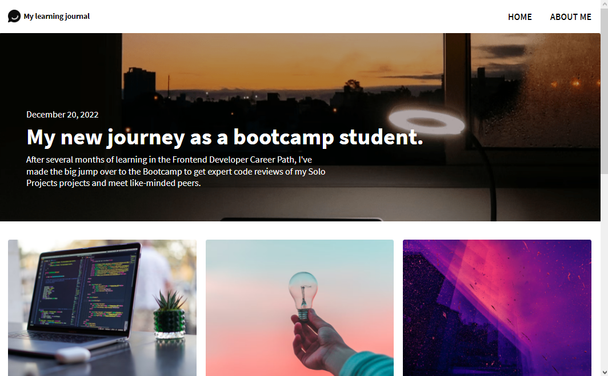
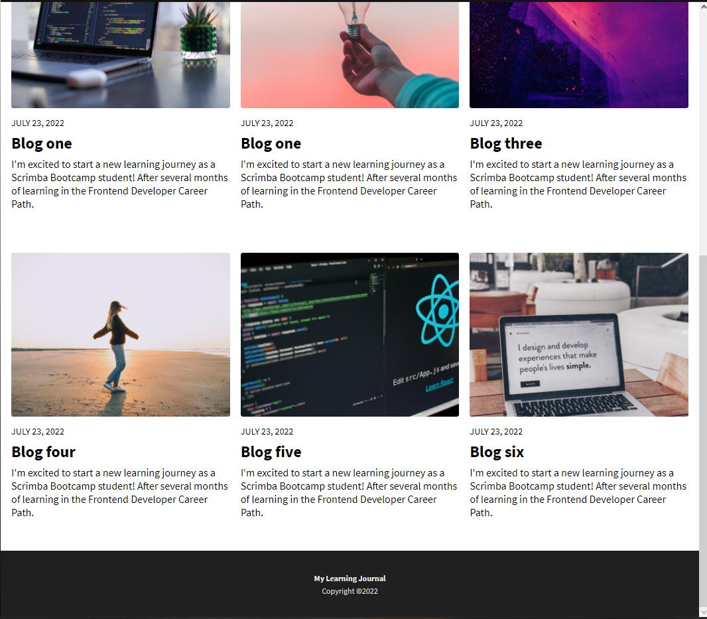
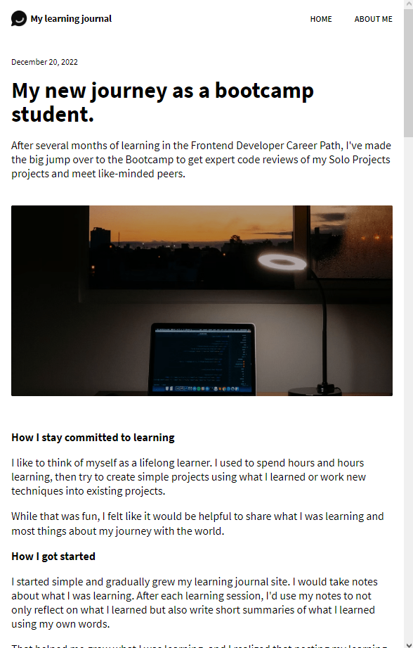
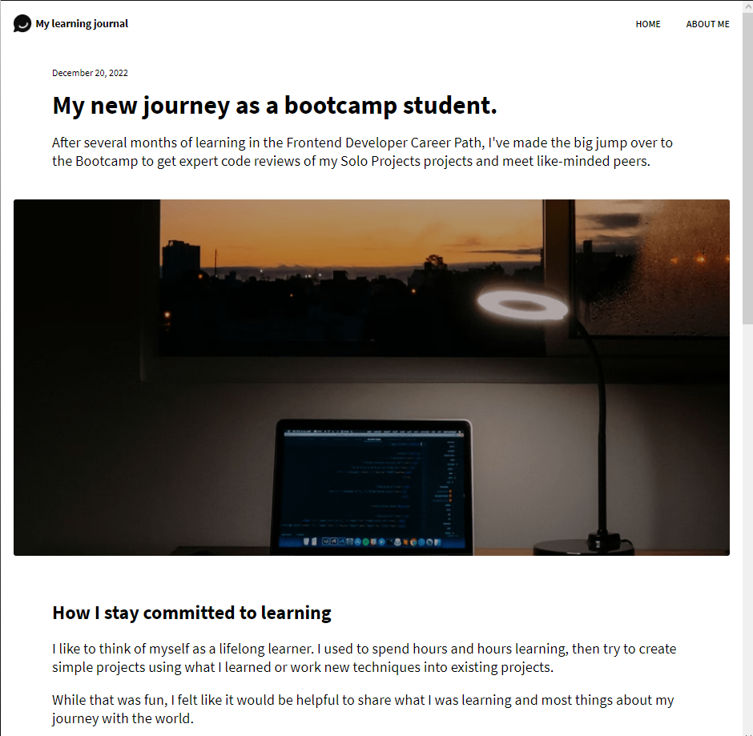
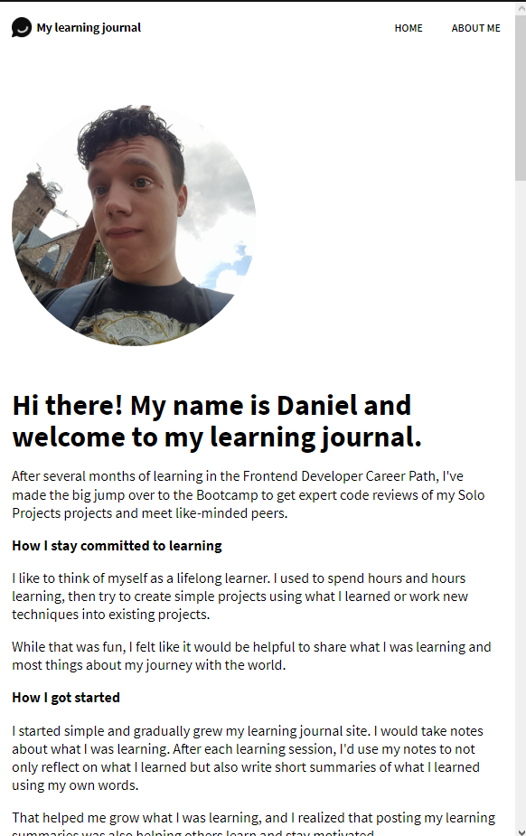
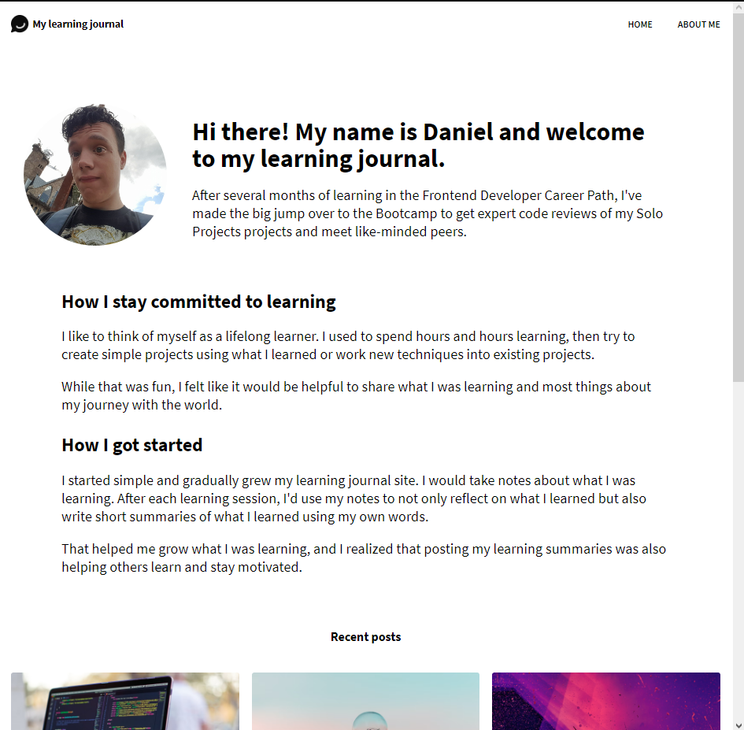

# Restaurant Ordering App 

Learning Journal/Blog Solo Project from [Scrimba](https://scrimba.com/learn/frontend)'s Essential JavaScript concepts module.

## Project Link

[Project Link] Hosted using Netlify 

## Previews
Home Page (Less than 600 pixels wide)
 
Home Page (Greater than or equal to 600 pixels wide)
 
Article Page (Less than 600 pixels wide)

Article Page (Greater than or equal to 600 pixels wide)

About Me Page (Less than 600 pixels wide)

About Me Page (Greater than or equal to 600 pixels wide)

## Project Functionality

- Display three separate web pages: Home page, Article page, and About Me page.
-Web page layouts change based on web page size.
